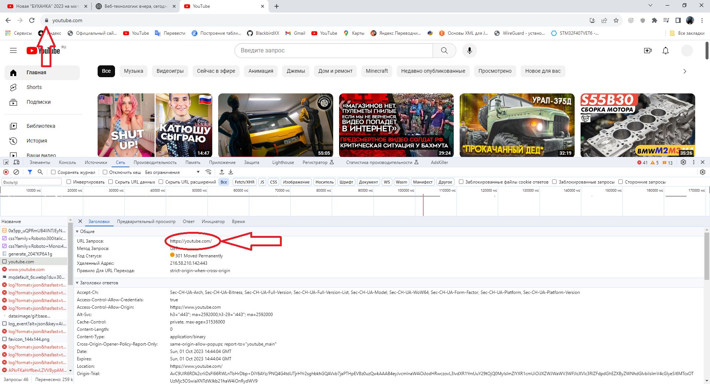
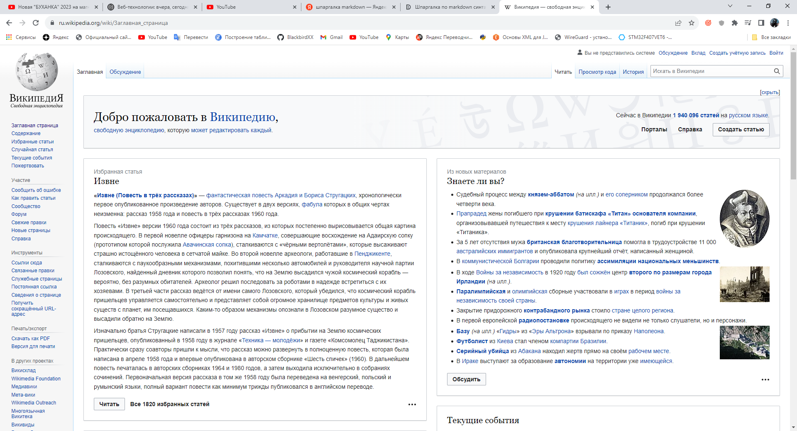
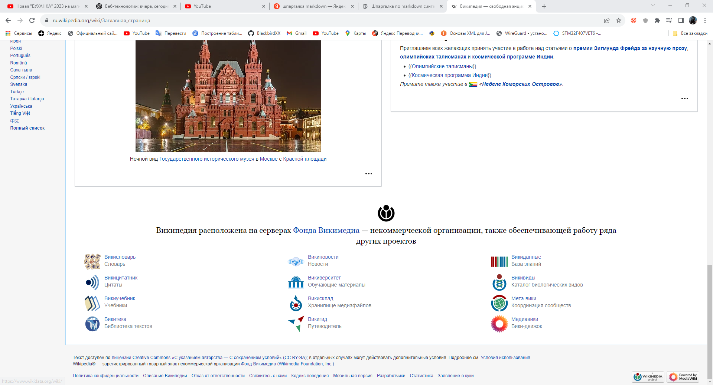
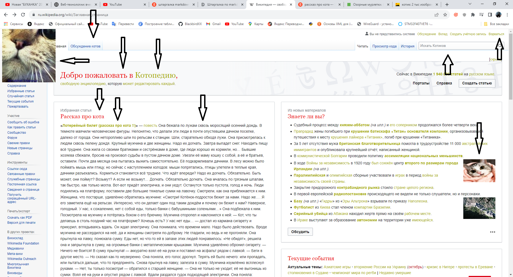
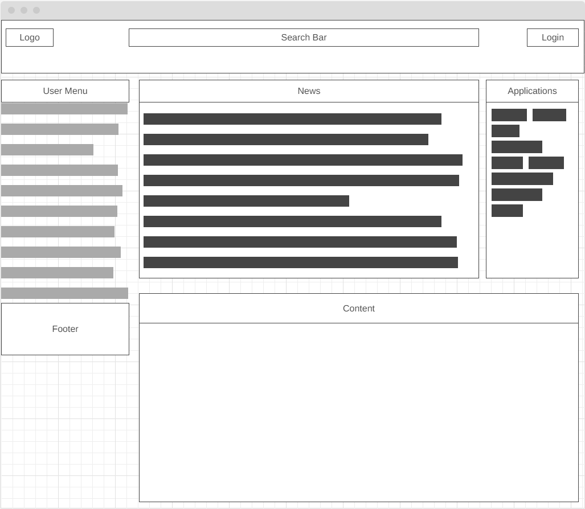
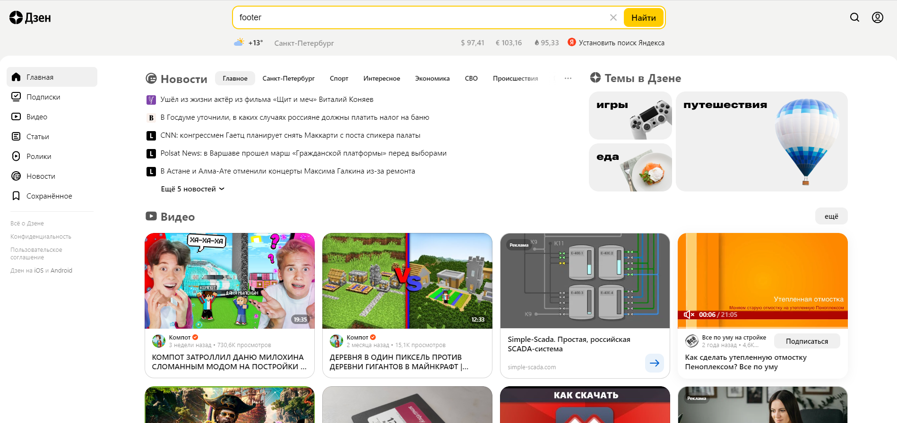

### 1. Определите, на каком протоколе работает сайт youtube.com.

YouTube работает на защищенном протоколе HTTPS

Очем свидетельствует замочек в адресной строке, а также это можно посмотреть в инструментах разработчика браузера Chrome.

### 2. Создайте файл 2_analyze.txt, в котором проанализируйте структуру страницы сайта https://ru.wikipedia.org/

Ссылка на фаил :
[2_analyze.txt](files/2_analyze.txt)

Скриншоты для наглядности :

### 3. Внесите не менее 10 изменений на страницу любой статьи сайта https://ru.wikipedia.org/

### 4. Создайте прототип низкой детализации сайта https://dzen.ru/ с помощью сайта https://wireframe.cc/

Прототип : 

Образец :

